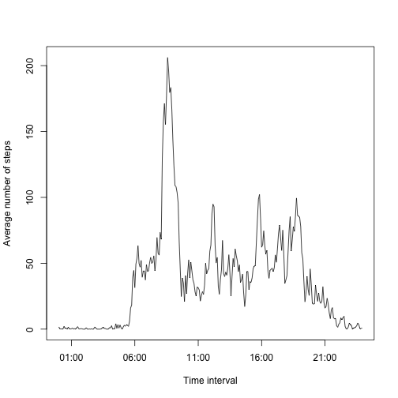
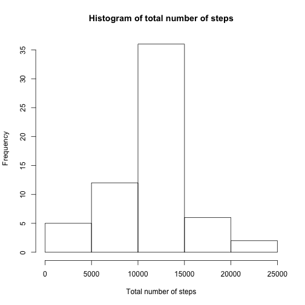

# Reproducible Research: Assignment 1

This report documents the steps of process and analysis of
the data in the file activity.csv along with the R codes
and their outputs for assignment 1.

## Loading and preprocessing the data

1. Load the data

 
 ```r
 df = read.csv(unzip("activity.zip"))
 ```

2. Process/transform the data (if necessary) into a format suitable for your analysis 

 
 ```r
 df$interval = sprintf("%04s", df$interval) # patching interval to have 4 digits
 ```

## What is mean total number of steps taken per day?

For this part of the assignment, the missing values in the dataset are ignored
as instructed (without being removed).

1. Calculate the total number of steps taken per day

 
 ```r
 totals = sapply(unique(df$date), function(d) sum(df[df$date==d, "steps"]))
 ```

2. Make a histogram of the total number of steps taken each day

 Note totals contains NAs, but they are igored by hist().

 
 ```r
 hist(totals, xlab="Total number of steps", main="Histogram of total number of steps")
 ```
 
  

3. Calculate and report the mean and median of the total number of steps taken per day

 
 ```r
 mean(totals, na.rm=T)
 ```
 
 ```
 ## [1] 10766.19
 ```

 
 ```r
 median(totals, na.rm=T)
 ```
 
 ```
 ## [1] 10765
 ```

Notice that the mean and median are slightly different.

## What is the average daily activity pattern?

1. Make a time series plot (i.e. type = "l") of the 5-minute interval (x-axis) and the average number of steps taken, averaged across all days (y-axis).

 Notice that the days with all NAs are omitted from the computation.

 
 ```r
 interval = unique(df$interval)
 
 avgs = sapply(interval, function(s) {
  steps = df[df$interval==s & !is.na(df$steps), "steps"]
  sum(steps)/length(steps)
 })
 
 dt = strptime(interval, "%H%M") # convert interval to timestamp
 
 plot(dt, avgs, type="l", xlab="Time interval", ylab="Average number of steps")
 ```
 
  

2. Which 5-minute interval, on average across all the days in the dataset, contains the maximum number of steps?

 
 ```r
 interval[which(avgs==max(avgs))]
 ```
 
 ```
 ## [1] "0835"
 ```

The 5-minute interval of 8:35am has the most number of steps.

## Imputing missing values

There are a number of days/intervals where there are missing values
(coded as NA). The presence of missing days may introduce bias into
some calculations or summaries of the data, so it may be desirable
to imput the missing values.

1. Calculate and report the total number of missing values in the dataset (i.e. the total number of rows with NAs)

 
 ```r
 sum(is.na(df$steps))
 ```
 
 ```
 ## [1] 2304
 ```

2. The strategy applied here for filling in all of the missing values in
the dataset is to imput the data with the means of 5-minute intervals.

3. Create a new dataset that is equal to the original dataset
but with the missing data filled in.

 
 ```r
 df2 = df
 
 df2[is.na(df2$steps), "steps"] = avgs
 ```

4. Make a histogram of the total number of steps taken each day and Calculate and report the mean and median total number of steps taken per day. Do these values differ from the estimates from the first part of the assignment? What is the impact of imputing missing data on the estimates of the total daily number of steps?

 As shown in the histogram, imputing missing data with 5-minute averages increased 8 days with total number of steps of 10766.1887 (`sum(avgs)`).

 
 ```r
 totals2 = sapply(unique(df2$date), function(d) sum(df2[df2$date==d, "steps"]))
 
 hist(totals2, xlab="Total number of steps", main="Histogram of total number of steps")
 ```
 
  
 
 ```r
 mean(totals2)
 ```
 
 ```
 ## [1] 10766.19
 ```
 
 ```r
 median(totals2)
 ```
 
 ```
 ## [1] 10766.19
 ```

## Are there differences in activity patterns between weekdays and weekends?

For this part the weekdays() function may be of some help here. Use the dataset with the filled-in missing values for this part.

1. Create a new factor variable in the dataset with two levels – “weekday” and “weekend” indicating whether a given date is a weekday or weekend day.

 
 ```r
 df2$daytype = factor("", levels=c("weekday","weekend"))
 
 wkdays = weekdays(as.Date(df2$date))
 df2$daytype = ifelse(wkdays %in% c("Saturday","Sunday"), "weekend", "weekday")
 ```

2. Make a panel plot containing a time series plot (i.e. type = "l") of the 5-minute interval (x-axis) and the average number of steps taken, averaged across all weekday days or weekend days (y-axis).

 
 ```r
 ### first get averages for weekdays and weekends respectively
 
 # get averages for weekdays
 weekday.avgs = sapply(interval, function(x) {
  steps = df2[df2$daytype=="weekday"&df2$interval==x,"steps"]
  sum(steps)/length(steps)
 })
 
 # get averages for weekends
 weekend.avgs = sapply(interval, function(x) {
  steps = df2[df2$daytype=="weekend"&df2$interval==x,"steps"]
  sum(steps)/length(steps)
 })
 
 # create a dataframe for the weekday and weekend averages
 
 df3 = data.frame(steps = weekday.avgs, interval=dt, daytype=c("weekday"))
 df3 = rbind(df3, data.frame(steps = weekend.avgs, interval=dt, daytype=c("weekend")))
 
 # do the panel plot
 
 library(lattice)
 
 hours = "1 hour"
 num = 25
 t_ini = df3$interval[1]
 
 xyplot(steps ~ interval|daytype, layout=c(1,2), type="l",
       xlab="Time interval (hour)",
       ylab="Number of steps",
       scales=list(x=list(at=seq(as.POSIXct(t_ini), by=hours, length=num),
       labels=format(seq(as.POSIXct(t_ini), by=hours, length=num), "%H"))),
       data=df3)
 ```
 
  

The panel plot indicates that there are clearly differences
in activity patterns between weekdays and weekends.
For example, there are more actitivies between 6:00am and 9:00am
on weekdays than on weedends.
